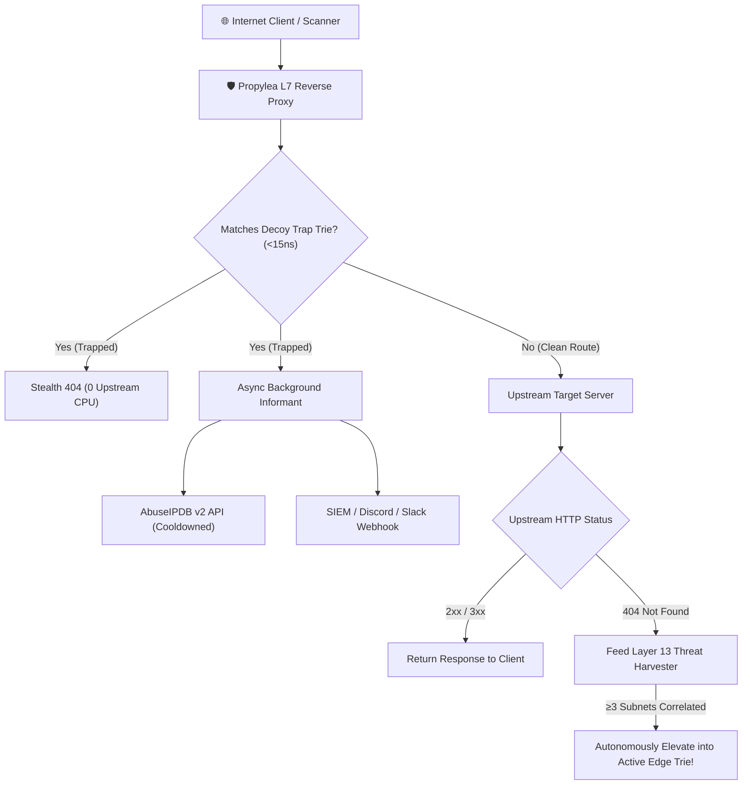
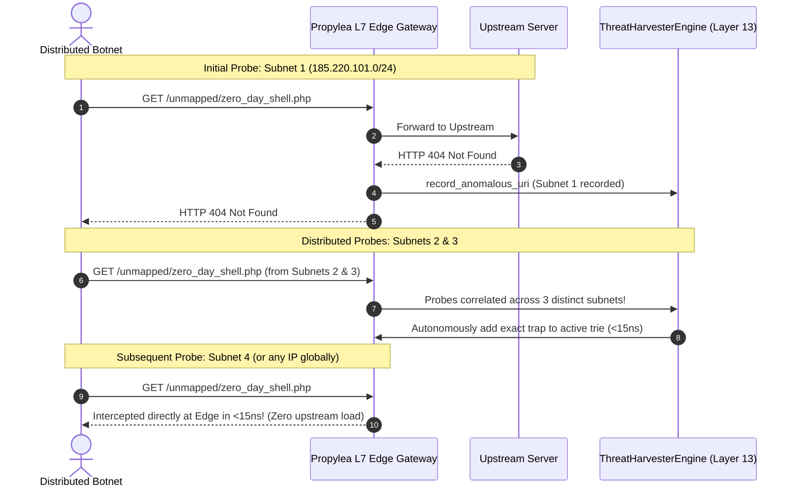

# 🛡️ Active Perimeter Defense & Threat Reporting

Propylea differs fundamentally from conventional reverse proxies (like Nginx, Caddy, or Traefik) by incorporating an **active perimeter defense engine**. Instead of passively forwarding malicious scanner traffic to your upstream web apps or databases, Propylea neutralizes scanners at the outer L7 edge in nanoseconds.

---

## ⚡ Mathematical Asymmetry & Microsecond Interception

Over 85% of malicious edge traffic consists of automated vulnerability sprayers scanning for:
* Leaked secrets (`/.env`, `/.git/config`, `/.aws/credentials`)
* CMS vulnerabilities (`/wp-login.php`, `/xmlrpc.php`, `/wp-admin`)
* Admin panels & database portals (`/phpmyadmin`, `/admin/config.php`, `/.well-known/pki-validation/`)
* Remote code execution endpoints (`/cgi-bin/`, `/solr/`, `/actuator/health`)

Propylea catches these patterns using an in-memory prefix trie evaluated in **$< 15\text{ ns}$**.



### Key Security Invariants:
1. **Zero Upstream Impact**: Hostile scanners never open TCP sockets, trigger DB lookups, or consume thread pool capacity on your upstream servers.
2. **Stealth 404 Responses**: Attackers receive a standard `404 Not Found` with an obfuscated `Server` banner. No "Forbidden", "WAF Blocked", or CAPTCHA hints are exposed that would alert the attacker that their probe was fingerprinted.
3. **Non-Blocking Telemetry**: Threat incident generation runs on background Tokio tasks without adding latency to the client response.

---

## 🔄 Closed-Loop Zero-Day Threat Harvesting (Layer 13)

When attackers scan for zero-day vulnerabilities not yet present in static blocklists, Propylea closes the loop through **autonomous mathematical correlation**:



---

## 📡 AbuseIPDB Auto-Reporting

If configured with an AbuseIPDB API key, Propylea automatically submits forensic reports for confirmed hostile probes:

```toml
[security]
enable_defense = true
abuseipdb_api_key = "YOUR_ABUSEIPDB_API_KEY"
```

### Free-Tier Safe Cooldown
AbuseIPDB's free tier provides 1,000 reports per 24 hours. Propylea employs an internal per-IP token bucket cooldown:
* Repeat hits from the same IP within the cooldown window (default: 15 minutes) are silently dropped from external reporting.
* Prevents API quota exhaustion during distributed brute-force attacks while maintaining 100% confidence reporting.

---

## 🔔 Generic Webhook Alerts (Slack, Discord, SIEM)

Stream security events directly to your security operations channel:

```toml
[security]
webhook_url = "https://discord.com/api/webhooks/..."
```

Propylea dispatches structured JSON incident alerts containing:
* Offending IP address
* Target decoy URI
* HTTP Method
* User-Agent
* Timestamp and geographic metadata (if available)

---

## 🔍 Forensic Telemetry Ring Buffer

Propylea records all edge activity into a thread-safe, lock-free in-memory ring buffer:
* **High-Precision Timing**: Microsecond request duration spans.
* **Privacy Sanitization**: Automatically scrubs query string credentials (`?token=`, `?key=`, `?password=`, `?auth=`).
* **Bounded Memory**: Fixed-size circular buffer (default: 10,000 records) guarantees deterministic memory utilization.
