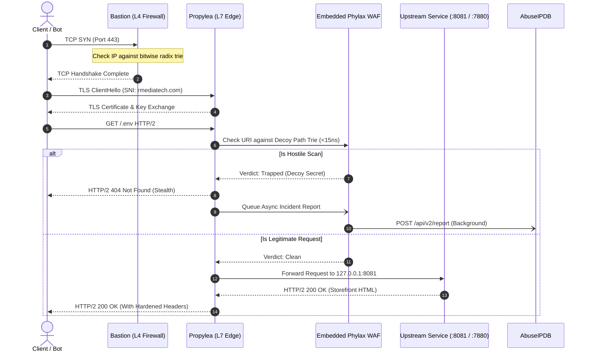

# 🛡️ Sovereign Defense Topology & Fleet Architecture

> **Comprehensive Reference for Operators, Developers & Architects**  
> Clarifying the concentric security rings protecting our nodes, websites, and services.

---

## 🏰 1. The Layman Mental Model: The Sovereign Fortress

When securing high-value web infrastructure, no single tool should do everything. Bloated "all-in-one" tools become slow, memory-hungry, and vulnerable. Instead, the Sovereign Rust Ecosystem uses **layered defense in depth** following the **One-Job-Principle (OJP)**.

Think of our servers as a fortified medieval citadel:

```
[ THE INTERNET ]
       │
       ▼
┌────────────────────────────────────────────────────────────────────────┐
│ 🌊 RING 1: THE MOAT & OUTER WALL (Bastion)                            │
│    • Layer 4 Firewall (Packets, IPs, SYN defense, eBPF/XDP)            │
│    • Drops DDoS floods and port scans before they touch software.      │
└───────────────────────────────────┬────────────────────────────────────┘
                                    │
                                    ▼
┌────────────────────────────────────────────────────────────────────────┐
│ 🏛️ RING 2: THE GRAND CITADEL GATE (Propylea)                          │
│    • Layer 7 Reverse Proxy & SNI TLS Multiplexer (Ports 80 & 443)      │
│    • Handles SSL encryption, routes domains, redirects HTTP to HTTPS.  │
│    • Governs RAM (< 15MB RSS) with autonomous memory vacuuming.        │
└───────────────────────────────────┬────────────────────────────────────┘
                                    │ (Embedded Inspection)
                                    ▼
┌────────────────────────────────────────────────────────────────────────┐
│ 🏹 RING 3: THE SENTRY STANDING AT THE GATE (Phylax)                   │
│    • 13-Layer Perimeter WAF & Decoy Path Trap (< 15ns lookup)          │
│    • Traps bots seeking /.env, /wp-admin; drops them with stealth 404s.│
│    • Automatically reports hostile IPs to AbuseIPDB in the background. │
└───────────────────────────────────┬────────────────────────────────────┘
                                    │
                                    ▼
┌────────────────────────────────────────────────────────────────────────┐
│ 🚪 RING 4: THE INNER ENTRANCE BOUNCER (Slow-Shield)                    │
│    • Layer 7.5 Credential Velocity Governor & Argon2id Equalizer       │
│    • Equalizes login response times so attackers cannot guess users.   │
│    • Throttles distributed credential-stuffing botnets.                │
└───────────────────────────────────┬────────────────────────────────────┘
                                    │
                                    ▼
┌────────────────────────────────────────────────────────────────────────┐
│ 👑 RING 5: THE SOVEREIGN APPLICATIONS                                  │
│    • RMediaTech (:8081) - Storefront, commercial engine & APIs         │
│    • Matrix Server (:8082) - Real-time encrypted messaging             │
│    • LiveKit SFU (:7880) - Real-time WebRTC audio & video streaming    │
└───────────────────────────────────┬────────────────────────────────────┘
                                    │
                                    ▼
┌────────────────────────────────────────────────────────────────────────┐
│ 📜 THE ROYAL NOTARY & SCRIBE (Sovereign Ledger)                        │
│    • Cryptographic Merkle Hash Chaining (SHA-256)                      │
│    • Tamper-evident, immutable audit trail of all state mutations.     │
└────────────────────────────────────────────────────────────────────────┘

[ 🌉 SPECIAL PURPOSE: CONDUIT - THE PRIVATE OPERATOR DRAWBRIDGE ]
• Conduit is NOT a public web reverse proxy.
• Conduit is our private bridge: sandboxed PTY terminals, 360° subnet
  radar, hardware intercom (audio/video), and encrypted file vaults.
```

---

## 📊 2. Ecosystem Disambiguation Matrix

To prevent confusion, this matrix defines the exact boundaries, technologies, and responsibilities of each sovereign tool:

| Crate / Tool | Sovereign Role | Network Layer | Primary Tech Stack | What It Replaces | What It Does NOT Do |
| :--- | :--- | :---: | :--- | :--- | :--- |
| **`bastion`** | Microsecond IP Firewall & SYN Defense | **L4** (Transport) | Rust, eBPF, XDP, Bitwise Radix Trie | `iptables`, `ufw`, `fail2ban` | Does not parse HTTP/HTTPS or terminate SSL. |
| **`propylea`** | Sovereign L7 Reverse Proxy & Gateway | **L7** (Application) | Rust, Hyper 1.4, Rustls 0.23, Tokio | **`caddy`**, **`nginx`**, `traefik`, Cloudflare proxy | Does not handle app business logic or store DB state. |
| **`phylax`** | 13-Layer Perimeter Defense & WAF Engine | **L7 Library** | Pure Rust, in-memory Radix Trie, PoW | Cloudflare WAF, ModSecurity, AWS WAF rules | Is not a standalone web server; embedded in Propylea & apps. |
| **`slow-shield`** | Cross-IP Velocity & Latency Equalizer | **L7.5** (Auth) | Rust, Argon2id, Ring Buffer | Redis rate-limiters, manual CAPTCHAs | Does not proxy web traffic or inspect packet headers. |
| **`conduit`** | Remote Bridge & Outpost Ops Engine | **L7 WebSocket Tunnel** | Rust, Tokio, PTY, V4L2, WebRTC | TeamViewer, ngrok, SSH bastion hosts | Is not our public web edge gateway (delegated to Propylea). |
| **`sovereign-ledger`** | Merkle Cryptographic Audit Daemon | **Mesh Service** | Rust, SHA-256 Hash Chaining, SQLite WAL | Datadog audit logs, AWS CloudTrail | Does not route user traffic or filter edge requests. |

---

## 🧭 3. Why Did We Replace Caddy and Nginx?

Many developers default to Caddy or Nginx without questioning their overhead. Here is why the sovereign fleet uses Propylea:

1. **Memory Starvation**:
   * **Caddy** runs on Go. Its garbage collector creates memory spikes, often idling between **45 MB and 120 MB RSS** per instance.
   * **Nginx** idles around 20–35 MB, but requires complex C modules (like ModSecurity) that double its footprint and introduce memory corruption risks.
   * **Propylea** runs in pure Rust. It maintains a **constant `< 15 MB RSS`** and actively returns unmapped heap pages to the Linux kernel via periodic `libc::malloc_trim` passes.
2. **Passive Forwarding vs. Active Nanosecond Interception**:
   * Traditional proxies blindly forward malicious reconnaissance (`/.env`, `/wp-login.php`, `/.git/config`) to upstream applications, wasting backend database connections and CPU cycles.
   * Propylea embeds **Phylax**: it evaluates incoming paths against an in-memory threat trie in **`< 15 ns`**. Bots receive a stealth `404 Not Found` without ever touching the upstream backend.
3. **Automated Incident Reporting**:
   * Neither Caddy nor Nginx reports attackers to collaborative intelligence out of the box. Propylea automatically queues verified probes and submits reports to **AbuseIPDB** asynchronously without degrading user response times.
4. **Zero Cloud Ingress Feudalism**:
   * No monthly fees to Cloudflare or AWS ALB. No proprietary third-party decryption of user traffic.

---

## 🌐 4. Fleet Node Ingress Architecture

Our production fleet is organized into dedicated nodes:

### Node 1 (`lin` - `rmediatech.com` & `matrix.rmediatech.com`)
* **Role**: Primary storefront, customer control plane, and real-time messaging server.
* **Ingress**: Bound to ports `80` (HTTP) and `443` (HTTPS).
* **Gateway**: **`propylea`** terminates multi-domain TLS (SNI) and routes to:
  * `127.0.0.1:8081` ➔ `rmediatech` (Storefront & Commercial API)
  * `127.0.0.1:8082` ➔ `matrix-server` (Chat & Communication Engine)
* **Underlying Defenses**: Embedded `phylax` active defense, `slow-shield` auth equalization, `sovereign-ledger` audit logging.

### Node 2 (`sfu` - `sfu.rmediatech.com`)
* **Role**: Dedicated WebRTC Selective Forwarding Unit (SFU) for personal and commercial high-bandwidth calls.
* **Ingress**: Bound to ports `80` (HTTP), `443` (HTTPS), and LiveKit media UDP ports.
* **Gateway**: **`propylea`** terminates TLS and tunnels full-duplex WebSockets to:
  * `127.0.0.1:7880` ➔ `livekit-server` (WebRTC signaling)
* **Underlying Defenses**: `propylea` edge defense drops scanning bots before they can probe WebRTC signaling sockets.

---

## 🔄 5. Request Lifecycle: Step-by-Step

Here is what happens when a packet hits port 443:


